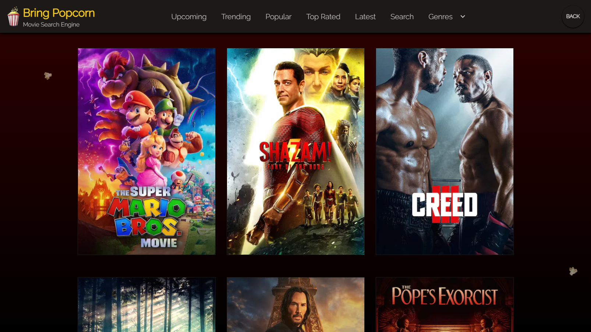
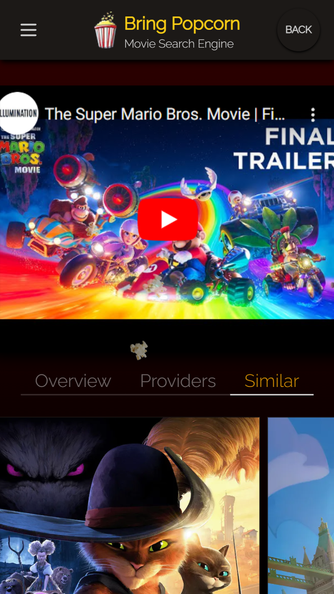
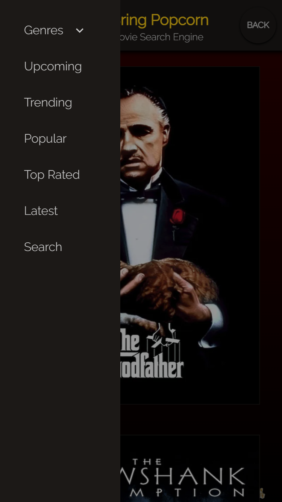
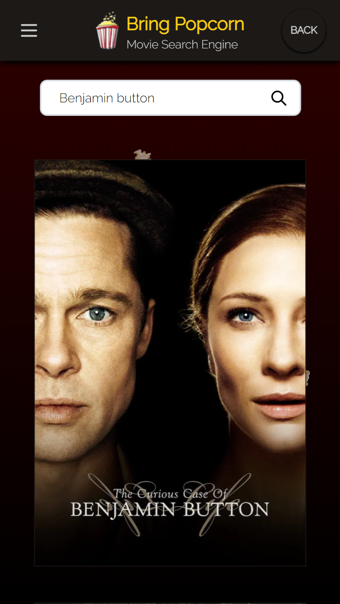

## Bring Popcorn

https://bring-popcorn.vercel.app/

## *Description*
___
Bring Popcorn Movie Website is a web application that helps users find "popcorn-worthy" movies by utilizing the IMDb API. The project is built using Next.js, a popular React framework, to ensure good SEO (Search Engine Optimization), caching, and faster loading speeds for an optimal user experience. The user interface is designed using Daisy UI, a CSS framework that provides a collection of ready-to-use UI components, giving the website a unique and visually appealing brand.

## *Table of Contents*
 ___

  - [Features](#features)
  - [Software](#software)
  - [License](#license)
  - [Questions](#questions)
  - [Screenshots](#screenshots)

## *Features*
___
- Browse Movies: Explore movies based on various criteria such as upcoming releases, top-rated movies, latest releases, trending movies, popular movies, and genres, allowing users to discover movies based on their preferences and interests.
- Movie Details: Get in-depth information about each movie, including ratings, budget, revenue, streaming options (where to stream, rent, or buy), and trailers.
- Similar Movies: Discover similar movies based on genre, actors, or other relevant criteria, allowing users to explore related movies and find new recommendations.
- User-friendly Interface: Enjoy a seamless browsing experience with a user-friendly interface that makes it easy to search and view movie details.
- Trailer Viewing: Watch movie trailers directly within the app, providing a convenient way to preview movies and make informed viewing choices.
- Responsive Design: Access Bring Popcorn on any device, including desktops, tablets, and mobile phones, with a responsive design that adapts to different screen sizes for optimal user experience.
- Comprehensive Movie Database: Access a vast movie database powered by the IMDb API, ensuring that users have access to accurate and up-to-date movie information.

## *Software*
___
This project was built using a combination of technologies and tools, including:

- Next.js: A popular React framework for building server-rendered React applications with features like server-side rendering (SSR), static site generation (SSG), and API routes.
- React: A popular JavaScript library for building user interfaces.
- JavaScript: A programming language used to create dynamic web pages and web applications.
- HTML: The standard markup language used to create web pages and web applications.
- CSS: A stylesheet language used to define the presentation of web pages and web applications.
- JSX: A syntax extension for JavaScript that allows you to write HTML-like code in your JavaScript files when working with React.
- Node: A JavaScript runtime that allows you to run JavaScript on the server-side.
- Tailwind CSS: A utility-first CSS framework that allows you to quickly and easily style your web pages and web applications.
- Daisy UI: A CSS framework that provides a collection of ready-to-use UI components for building responsive web applications.
- GIMP: An open-source image editing software that can be used for creating and editing graphics and images.
- Heroku: A cloud platform that allows you to deploy, manage, and scale web applications, including Next.js applications.
- IMDb API: An API provided by IMDb (Internet Movie Database) that allows you to fetch movie and TV show data, such as metadata, ratings, and cast information.

## *License*
___
This application is covered under the MIT license.

For more information about this license please visit https://opensource.org/licenses/MIT

## *Questions*
___
For comments/concerns please contact me by one of the following:

LinkedIn: https://www.linkedin.com/in/cody-cooper-3a951a24b/

Github: https://github.com/Ccooper9893

## *Screenshots (Mobile/Desktop)*
___

 

 

 

